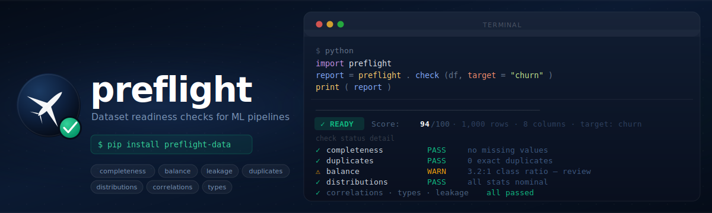

[](https://pypi.org/project/preflight-data/)
[](https://pypi.org/project/preflight-data/)
[](https://github.com/psf/black)

---

Dataset readiness checks for ML pipelines.
Use `preflight` to catch data blockers before training and deployment.

## Why preflight

- Runs fast checks for data quality, target risk, schema/type issues, split integrity, and statistical anomalies.
- Produces machine-readable findings and a CI gate decision (`PASS`/`FAIL`).
- Keeps output stable with schema versioning for downstream tooling.

## Quickstart

Install:

```bash
pip install preflight-data
```

Python API:

```python
import pandas as pd
import preflight

df = pd.read_csv("data.csv")
report = preflight.run(df, target="churn", profile="ci-balanced")

print(report)
```

CLI:

```bash
preflight run data.csv --target churn --profile ci-balanced --format text
```

Example output:

```text
Preflight Run Report
────────────────────────────────────────────────────────
Gate: PASS
Heuristic Score: 97.0/100
Profile: ci-balanced
Dataset: 1000/1000 rows analyzed across 6 columns
Target: churn
Summary: 8 info, 1 warn, 0 error, 0 critical

Gate reasons:
- No findings met fail conditions for this profile

Findings:
- [WARN] completeness.missingness: Overall missingness is 1.8% (108 cells missing across dataset). (confidence=0.95)
- [INFO] duplicates.exact: No exact duplicate rows detected. (confidence=0.95)
- [INFO] balance.class_imbalance: Class distribution is within configured tolerance. (confidence=0.90)
```

## HTML report preview

If you want to see what the generated HTML report looks like, open:

- [preflight_report.html](/Users/rwolbeck/preflight/preflight_report.html)
- [preflight_public_datasets_demo.ipynb](/Users/rwolbeck/preflight/notebooks/preflight_public_datasets_demo.ipynb)

The notebook contains rendered `report.to_html()` output cells.

## Core model

- `finding`: one detected issue or advisory signal
- `severity`: `info | warn | error | critical`
- `gate`: policy decision based on severities (`PASS | FAIL`)
- `score`: heuristic summary for trend/comparison, not statistical truth

Score guidance:

- Good for rough trend tracking across runs
- Not a probability of model success

## Common workflows

### Dataset readiness (single table)

```python
report = preflight.run(df, target="churn", profile="ci-balanced")
```

### Split integrity (train/validation or train/test)

```python
split_report = preflight.run_split(train_df, valid_df, profile="ci-balanced")
```

## Policy profiles

Built-in profiles:

- `exploratory`: permissive, useful in notebooks
- `ci-balanced`: practical CI default
- `ci-strict`: highest sensitivity for blocking conditions

Example:

```bash
preflight run data.csv --target churn --profile ci-strict --format json
```

`--fail-on` override:

```bash
preflight run data.csv --target churn --profile ci-balanced --fail-on error,critical
```

Policy argument rules:

- Use either `--profile` or `--policy-file` (mutually exclusive).
- `--fail-on` is only supported with `--profile`.
- Invalid policy/config files fail fast at load time.

## CLI reference

```bash
# Recommended policy-first commands
preflight run data.csv --target churn --profile ci-balanced --format json
preflight run-split train.csv test.csv --profile ci-balanced --format markdown

# Optional artifacts
preflight run data.csv --target churn --format text --output report.txt --output-html report.html

# Compare against baseline JSON report
preflight compare current.json baseline.json --max-score-drop 3 --fail-on-new-error

# Suppressions
preflight suppress add --file suppressions.json --check-id leakage.high_correlation --reason "known safe"
preflight suppress list --file suppressions.json
preflight suppress validate --file suppressions.json --fail-on-expired
```

### HTML output

CLI:

```bash
preflight run data.csv --target churn --profile ci-balanced --format text --output-html report.html
```

Python:

```python
report = preflight.run(df, target="churn", profile="ci-balanced")
html = report.to_html()
with open("report.html", "w", encoding="utf-8") as f:
    f.write(html)
```

This creates a shareable HTML report you can attach to CI artifacts, docs, or review tickets.

Exit codes:

- `0`: gate pass
- `2`: gate fail or explicit CLI validation failure

## Output schema contract

`RunReport.to_dict()` includes stable contract keys:

- `schema_version`
- `run`
- `dataset`
- `gate`
- `score`
- `summary`
- `findings`

Per-finding payload includes evidence and explainability fields:

- `check_id`, `title`, `domain`, `severity`, `suppressed`
- `suggested_action`, `docs_url`
- `evidence.metrics`, `evidence.threshold`, `evidence.samples`

## Examples

- Realistic workflow notebook:
  - [simple_example.ipynb](/Users/rwolbeck/preflight/notebooks/simple_example.ipynb)
- Public dataset demo notebook:
  - [preflight_public_datasets_demo.ipynb](/Users/rwolbeck/preflight/notebooks/preflight_public_datasets_demo.ipynb)
- Script demo:
  - [public_datasets_demo.py](/Users/rwolbeck/preflight/examples/public_datasets_demo.py)

## Legacy compatibility

Legacy `check(...)` and `check_split(...)` APIs are still available for compatibility, but `run(...)` and `run_split(...)` are recommended for policy-first workflows.

Migration status: the policy-first runner now uses native checks for class balance, completeness, leakage, duplicates, distributional health, correlations, and types. Legacy APIs remain supported during migration.

Compatibility namespace:

- `preflight.legacy.check(...)`
- `preflight.legacy.check_split(...)`
- `preflight.legacy.Report`

## Development

```bash
make env
conda activate preflight
make install-dev
make test
make lint
make typecheck
make build
```

## Supported versions

- Python: 3.9-3.13
- pandas: >=1.3
- numpy: >=1.21

## License

Apache-2.0
